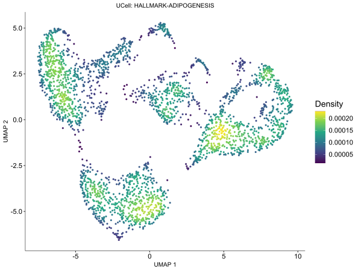

# Mast cell analysis based on total cite-seq dataset
---
**Batch effect is corrected by harmony**

*Based on the following Seurat oject:*
  ```r
 library(Seurat)
 library(dplyr)
 library(stringr)
 library(ggplot2)
 library(clustree)
 library(harmony)
 library(tidydr)
 setwd("C:/Users/Taotao/OneDrive/桌面/data/Thymus")
 MC <- readRDS("./3cell.rds")
  ```
## 1) Recluster of Mast cells
```r
Mastcell <- subset(MC, celltype == "Mast cell")
g2m_genes = cc.genes$g2m.genes
g2m_genes = CaseMatch(search = g2m_genes, match = rownames(Mastcell))
# 提取s特征向量
s_genes = cc.genes$s.genes
s_genes = CaseMatch(search = s_genes, match = rownames(Mastcell))
# 对细胞周期阶段进行评分
Mastcell <- CellCycleScoring(object = Mastcell,
                                     s.features = s_genes,
                                     g2m.features = g2m_genes,
                                     set.ident = TRUE) #set.ident 是否给每个细胞标注一个细胞周期标签
# plot
Mastcell@meta.data %>% ggplot(aes(S.Score, G2M.Score))+geom_point(aes(color=Phase))+
  theme_minimal()
```

### 1.1a) FindClusters with a different resolution
```r
Mastcell <- FindNeighbors(Mastcell, reduction = "pca", dims = 1:10)
Mastcell <- FindClusters(Mastcell, resolution = 0.2)
```
### 1.1b) Normalize them from the start
```r
Mastcell=CreateSeuratObject(counts = GetAssayData(Mastcell, assay = "RNA", slot = 'counts'),
                       meta.data = Mastcell@meta.data) 
Mastcell <- NormalizeData(Mastcell) %>% FindVariableFeatures() %>% ScaleData() %>% RunPCA
# Mastcell <- ScaleData(Mastcell, vars.to.regress = c("S.Score", "G2M.Score"), features = rownames(Mastcell))
# Mastcell <- RunPCA(Mastcell)
Mastcell <- RunHarmony(Mastcell, group.by.var = "group")
Mastcell <- FindNeighbors(Mastcell, reduction = "harmony", dims = 1:10)
Mastcell <- FindClusters(Mastcell, resolution = 0.2)
table(Mastcell@meta.data$seurat_clusters)
Mastcell <- RunUMAP(Mastcell, reduction = "harmony", dims = 1:10, return.model = TRUE)
```
I finally choose **1b)** to recluster mast cells for downstream analysis.

### 1.2) Annotation for mast cell subtypes

Find markers for the clusters:
```r
Idents(Mastcell) <- "seurat_clusters"
Mastcell_markers <-
  FindAllMarkers(
    object = Mastcell,
    test.use = "wilcox",
    only.pos = TRUE,
    logfc.threshold = 0.1,
    min.pct = 0.25,
    slot = "data"
  )
Mastcell.markers = Mastcell_markers %>% dplyr::select(gene, everything()) %>% subset(p_val < 0.05)
top20_Mastcell = Mastcell.markers %>% group_by(cluster) %>% top_n(n = 20, wt = avg_log2FC)
```
Annotate mast cell subtypes according to their markers
```r
Idents(Mastcell) <- "seurat_clusters"
celltype = data.frame(ClusterID = 0:4,
                      celltype = 'unknown')
celltype[celltype$ClusterID %in% c(0), 2] = 'Cycling MC'
celltype[celltype$ClusterID %in% c(1), 2] = "Mcpt9 medium MC"
celltype[celltype$ClusterID %in% c(2), 2] = "Mcpt9 high MC"
celltype[celltype$ClusterID %in% c(3), 2] = "Nr4a1 high MC"
celltype[celltype$ClusterID %in% c(4), 2] = "Lrmda+ MC"
sce.in = Mastcell
sce.in@meta.data$celltype = "NA"
for (i in 1:nrow(celltype)) {
  sce.in@meta.data[which(sce.in@meta.data$RNA_snn_res.0.2 == celltype$ClusterID[i]), 'celltype'] <-
    celltype$celltype[i]
}

Mastcell <- sce.in
rm(sce.in)
```
### 1.3) Dimploting for Mast cells

**Color palette definition:**
```r
allcolour=  c(
"#D0AFC4",
"#89558D",
"#AFC2D9",
"#435B95",
"#79B99D",
"#D55640",
"#E69F84",
"#6CB8D2",
"#479D88",
"#415284",
"#C6367A",
"#ECDC52",
"#D1352B",
"#9B5B33"
  )
names(allcolour) <-
  c('Mcpt9 high MC', 'Mcpt9 medium MC', 'Cycling MC', 'Nr4a1 high MC', 'Lrmda+ MC', "IE-hpD07", "IE-hpD14", "LP-hpD0", "LP-hpD07", "LP-hpD14", "BMCP", "GMP", "DN(P)", "DN(Q)")
```
**UMAP reduction for Mast cell subclusters:**
```r
DimPlot(Mastcell, group.by = "celltype",pt.size = 2,cols = allcolour)+theme_dr()  + 
          guides(color = guide_legend(override.aes = list(size=5)))+ theme(panel.grid=element_blank(),
          legend.title = element_blank(), #去掉legend.title 
        legend.text = element_text(size=20), #设置legend标签的大小
        legend.key.size=unit(1,'cm'))+ggtitle("Mast cell subclusters")+theme(plot.title = element_text(size = 20, hjust = 0.5)) # 800*600
```

```r
tissuecolor <- c("#C6307C", "#4991C1")
names(tissuecolor) <- c("Epithelium", "LP")
Mastcell$tissue <- str_replace(Mastcell$tissue, "IE", "Epithelium")

DimPlot(Mastcell, group.by = "tissue",pt.size = 2,cols = tissuecolor)+theme_dr()  + 
          guides(color = guide_legend(override.aes = list(size=5)))+ theme(panel.grid=element_blank(),
          legend.title = element_blank(), #去掉legend.title 
        legend.text = element_text(size=20), #设置legend标签的大小
        legend.key.size=unit(1,'cm'))+ggtitle("Mast cell origins")+theme(plot.title = element_text(size = 20, hjust = 0.5)) # 850*600
```

 
```r
DimPlot(Mastcell, group.by = "group",pt.size = 2,cols = allcolour)+theme_dr()  + 
          guides(color = guide_legend(override.aes = list(size=5)))+ theme(panel.grid=element_blank(),
          legend.title = element_blank(), #去掉legend.title 
        legend.text = element_text(size=20), #设置legend标签的大小
        legend.key.size=unit(1,'cm'))+ggtitle("Mast cell samples")+theme(plot.title = element_text(size = 20, hjust = 0.5)) # 800*600
```


```r
FeaturePlot(MC, features = c("Mki67", "Lrmda", "Mcpt9", "Nr4a1")) #700*600
```

```r
DotPlot(MC,features = c("Mki67", "Lrmda", "Mcpt9", "Nr4a1"), group.by = "group") #700*600
```

```r
DotPlot(MC,features = c("Mki67", "Lrmda", "Mcpt9", "Nr4a1"), group.by = "celltype") #700*600
```


### 1.4) Calculating cell proportion

**Calculating cell proportion in different samples:**
```r
Idents(Mastcell) <- "celltype" 
prop.table(table(Idents(Mastcell)))
table(Idents(Mastcell), Mastcell$group)

Cellratio <- prop.table(table(Idents(Mastcell), Mastcell$group), margin = 2) #计算各组样本不同细胞群比例
Cellratio <- as.data.frame(Cellratio)
Cellratio$Var1 <- factor(factor(Cellratio$Var1, levels = c("Cycling MC", "Lrmda+ MC", "Mcpt9 high MC", "Mcpt9 medium MC", "Nr4a1 high MC")))
colourCount = length(unique(Cellratio$Var1))
library(ggplot2)
ggplot(Cellratio) + 
  geom_bar(aes(x =Var2, y= Freq, fill = Var1),stat = "identity",width = 0.7,size = 0.5,colour = '#222222')+
  scale_fill_manual(values = allcolour)+ 
  theme_classic() +
  labs(x='Sample',y = 'Ratio')+
  coord_flip()+
  theme(panel.border = element_rect(fill=NA,color="black", size=0.5, linetype="solid"), legend.title= element_blank())+ggtitle("Mast cell subtype proportion in different samples")+theme (text = element_text(size =15),plot.title = element_text (hjust=0.5)) # 700*600
```

**Calculating samples proportion in different celltypes:**
```r
Idents(Mastcell) <- "celltype"
prop.table(table(Idents(Mastcell)))
table(Mastcell$group, Idents(Mastcell))

Cellratio <- prop.table(table(Mastcell$group, Idents(Mastcell)), margin = 2) #计算不同细胞群中各样本比例
Cellratio <- as.data.frame(Cellratio)
colourCount = length(unique(Cellratio$Var1))
library(ggplot2)
ggplot(Cellratio) + 
  geom_bar(aes(x =Var2, y= Freq, fill = Var1),stat = "identity",width = 0.7,size = 0.5,colour = '#222222')+
  scale_fill_manual(values = allcolour)+ 
  theme_classic() +
  labs(x='Celltype',y = 'Ratio')+
  coord_flip()+
  theme(panel.border = element_rect(fill=NA,color="black", size=0.5, linetype="solid"), legend.title= element_blank())+ggtitle("Different sample proportion in Mast cell subtype")+theme (text = element_text(size =15),plot.title = element_text (hjust=0.5)) # 700*600
```


### 1.5) Heatmap for Mast cell subtype markers

**First, perform pseudobulk analysis for mast cell subtypes:**
```r
exp <- AggregateExpression(Mastcell, group.by = 'celltype', assays = "RNA") %>%
  data.frame() %>% as.matrix()
colnames(exp) <- c("Cycling MC", "Lrmda+ MC","Mcpt9 high MC","Mcpt9 medium MC","Nr4a1 high MC")
```
**Second, log10 and z.scores transformation of expression matrix:**
```r
log10.exp <- log10(exp+1) # 1 为pseudocount, 避免count为0时对数未定义的情况
z.scores <- (log10.exp -
               rowMeans(log10.exp))/apply(log10.exp,1,sd)
#删除NaN数据
log10.exp <- log10.exp[complete.cases(log10.exp),]
z.scores <- z.scores[complete.cases(z.scores),]
```
**Heatmap for z.scores:**
```r
library(pheatmap)
pheatmap(z.scores[unique(top20_Mastcell$gene),], 
         cutree_row = 4,
         color = colorRampPalette(c("#3d54a1", "#8b83bc", "#e4d9eb", "#f8ddd3", "#e58065", "#df553f"))(2000),
         cluster_rows = T,
         show_rownames = T, 
         cluster_cols = T,
         show_colnames = T,
         angle_col = 45,
         legend_labels = "z.scores",
         main = "Pseodobulk heat map for top20 genes or proteins")
```


### 1.6) BMCP and DN cells projected to Mast cell

***BMCP projection***

**Set the working directory:**
```r
setwd("C:/Users/Taotao/OneDrive/桌面/data/scRNA integrated data")
```
**Read the BMCP file:**
```r
library(readxl)
all.counts <- read_excel("BMCPs and GMPs.xlsx")
gene.names <- all.counts$ID
all.counts <- as.matrix(all.counts[,-1])
rownames(all.counts) <- gene.names
dim(all.counts)
```
**Find anchors for BMCP:**
```r
reference <- Mastcell
small=CreateSeuratObject(all.counts)
small=NormalizeData(small)
anchors <- FindTransferAnchors(reference = reference, query = small,
                               dims = 1:10, reference.reduction = "pca")

predictions <- TransferData(anchorset = anchors, refdata = reference$group,
                            dims = 1:10)

small <- AddMetaData(small, metadata = predictions)

small
table(small$predicted.id)
```
```r
small <- MapQuery(anchorset = anchors, reference = reference, query = small,
                       #refdata = list(seurat_clusters = "seurat_clusters"),  #可以映射多个标签
                       refdata = list( celltype="celltype"), 
                       reference.reduction = "pca", 
                       reduction.model = "umap")
```
```r
small@reductions$umap <- small@reductions$ref.umap
merged <- merge(reference, small)

merged[["umap"]] <- CreateDimReducObject(
  embeddings = rbind(reference[["umap"]]@cell.embeddings,
                     small[["umap"]]@cell.embeddings),
  assay = "RNA", key = "UMAP_")
```

```r
Idents(merged) <- "celltype"
Idents(small) <- "orig.ident"
Idents(reference) <- "celltype"

Idents(merged, cells = colnames(small)) <- Idents(small)
Idents(merged, cells = colnames(reference)) <- Idents(reference)

merged$celltype <- Idents(merged)
```

```r
DimPlot(merged, group.by = "celltype",pt.size = 2,cols = allcolour)+theme_dr()  + 
          guides(color = guide_legend(override.aes = list(size=5)))+ theme(panel.grid=element_blank(),
          legend.title = element_blank(), #去掉legend.title 
        legend.text = element_text(size=20), #设置legend标签的大小
        legend.key.size=unit(1,'cm'))+ggtitle("BMCP Projection")+theme(plot.title = element_text(size = 20, hjust = 0.5))
```

***DN projection***

**Fisrt, project DN(P) to the whole CITE-seq data**
```r
setwd("C:/Users/Taotao/OneDrive/桌面/data/Thymus")
library(Seurat)
library(dplyr)
library(stringr)
library(ggplot2)
library(clustree)
library(harmony)
library(tidydr)
library(ggunchull)
library(ggrepel)
thymus <- readRDS("./mouse_thymus.rds")
table(thymus$celltype)
reference <- readRDS("./totalCITE-seq.rds")
small <- subset(thymus, celltype == "DN(P)")
```
```r
small=NormalizeData(small)
anchors <- FindTransferAnchors(reference = reference, query = small,
                               dims = 1:10, reference.reduction = "pca")

predictions <- TransferData(anchorset = anchors, refdata = reference$celltype,
                            dims = 1:10)

small <- AddMetaData(small, metadata = predictions)

small
table(small$predicted.id)
```

```r
small <- MapQuery(anchorset = anchors, reference = reference, query = small,
                       #refdata = list(seurat_clusters = "seurat_clusters"),  #可以映射多个标签
                       refdata = list( celltype="celltype"), 
                       reference.reduction = "pca", 
                       reduction.model = "umap")
```
```r
small@reductions$umap <- small@reductions$ref.umap
merged <- merge(reference, small)

merged[["umap"]] <- CreateDimReducObject(
  embeddings = rbind(reference[["umap"]]@cell.embeddings,
                     small[["umap"]]@cell.embeddings),
  assay = "RNA", key = "UMAP_")

Idents(merged) <- "celltype"
Idents(small) <- "celltype"
Idents(reference) <- "celltype"

Idents(merged, cells = colnames(small)) <- Idents(small)
Idents(merged, cells = colnames(reference)) <- Idents(reference)

merged$celltype <- Idents(merged)
merged$celltype <- factor(merged$celltype, levels = c("CD11b- cDC", "CD11b+ cDC", "Cycling CD11b- cDC", "Cycling CD11b+ cDC", "Epithelium", "ILC2", "ILC3", "Macrophage", "Mast cell", "Monocyte", "NK/T cell", "Plasma cell", "Unknown Cycling cell", "DN(P)", "DN(Q)"))
```
```r
clusterCols <-
  c(
    "#BBDD78",
    "#EBAEA9",
    "#EBCC96",
    "#CBE5DE",
    "#FCED82",
    "#EED0E0",
    "#DBC9B3",
    "#CB95BB",
    "#AED0DF",
    "#95A6DA",
    "#BFA6C9",
    "#8ECFF8",
    "grey",
    "#D1352B",
    "#9B5B33"
  )
names(clusterCols) <-
  c(
    'ILC3',
    'ILC2',
    'Plasma cell',
    'CD11b- cDC',
    'Cycling CD11b- cDC',
    'CD11b+ cDC',
    'Cycling CD11b+ cDC',
    'Mast cell',
    'NK/T cell',
    'Macrophage',
    'Monocyte',
    'Epithelium',
    'Unknown Cycling cell',
    'DN(P)',
    'DN(Q)'
  )
DimPlot(
  merged,
  reduction = "umap",
  group.by = "celltype",
  cols = clusterCols,
  label.size = 4,
  pt.size = 0.3
)+ theme_dr()  + 
          guides(color = guide_legend(override.aes = list(size=5)))+ theme(panel.grid=element_blank(),
          legend.title = element_blank(), #去掉legend.title 
        legend.text = element_text(size=15), #设置legend标签的大小
        legend.key.size=unit(0.8,'cm'))+ggtitle("DN(P) Projection")+theme(plot.title = element_text(size = 20, hjust = 0.5)) # 900*600
```
%20Projection.svg)
%20Projection.svg)
**Second, subset DN(P) which were projected to mast cells**
```r
small <- subset(small, predicted.id == "Mast cell")
reference <- readRDS("C:/Users/Taotao/OneDrive/桌面/data/2024.8.14 harmony analysis/MC_by_trace.rds")
```
```r
small=NormalizeData(small)
anchors <- FindTransferAnchors(reference = reference, query = small,
                               dims = 1:10, reference.reduction = "pca",  k.filter = 300) # k.filter = 700 for DN(Q)

predictions <- TransferData(anchorset = anchors, refdata = reference$group,
                            dims = 1:10)

small <- AddMetaData(small, metadata = predictions)

small
table(small$predicted.id)
```
```r
small <- MapQuery(anchorset = anchors, reference = reference, query = small,
                       #refdata = list(seurat_clusters = "seurat_clusters"),  #可以映射多个标签
                       refdata = list( celltype="celltype"), 
                       reference.reduction = "pca", 
                       reduction.model = "umap")
```
```r
small@reductions$umap <- small@reductions$ref.umap
merged <- merge(reference, small)

merged[["umap"]] <- CreateDimReducObject(
  embeddings = rbind(reference[["umap"]]@cell.embeddings,
                     small[["umap"]]@cell.embeddings),
  assay = "RNA", key = "UMAP_")

Idents(merged) <- "celltype"
Idents(small) <- "celltype"
Idents(reference) <- "celltype"

Idents(merged, cells = colnames(small)) <- Idents(small)
Idents(merged, cells = colnames(reference)) <- Idents(reference)

merged$celltype <- Idents(merged)
merged$celltype <- factor(merged$celltype, levels = c("Cycling MC", "Lrmda+ MC", "Mcpt9 high MC", "Mcpt9 medium MC", "Nr4a1 high MC", "DN(P)", "DN(Q)"))
```
```r
DimPlot(merged, group.by = "celltype",pt.size = 2,cols = allcolour)+theme_dr()  + 
          guides(color = guide_legend(override.aes = list(size=5)))+ theme(panel.grid=element_blank(),
          legend.title = element_blank(), #去掉legend.title 
        legend.text = element_text(size=20), #设置legend标签的大小
        legend.key.size=unit(1,'cm'))+ggtitle("DN(P) Projection")+theme(plot.title = element_text(size = 20, hjust = 0.5))
```
%20Projection%20to%20MC.svg)
%20Projection%20to%20MC.svg)


### 1.7) CytoTRACE and CytoTRACE2 for Mast cells
```r
library(CytoTRACE2)
#######输入seurat 对象###########
cytotrace2_result_sce <- cytotrace2(Mastcell, 
                                is_seurat = TRUE, 
                                slot_type = "counts", 
                                species = 'mouse',
                                seed = 12346)
Mastcell <- cytotrace2_result_sce
rm(cytotrace2_result_sce)
setwd("C:/Users/Taotao/OneDrive/桌面/data/2024.8.14 harmony analysis")
saveRDS(Mastcell, "./MC_by_trace.rds")
```

## 2) The Relationship between LPMCs and IEMCs

### 2.1) Trajectory inference

#### 2.1.1) Diffusion Map
```r
setwd("C:/Users/Taotao/OneDrive/桌面/data/2024.8.14 harmony analysis")
MC <- readRDS(file = "./MC_by_trace.rds")
library(Seurat) 
library(SingleCellExperiment)
MC <- subset(MC, group %in% c("LP-hpD07", "LP-hpD14", "IE-hpD07", "IE-hpD14"))
Idents(MC) <- "celltype"
sce <- as.SingleCellExperiment(MC)
#this has the cell classification
table(sce$ident)
```

```r
#this step may take a long time (days) or not finish. It is recommend to send it to the cluster as a script that reads the Seurat or the single cell object, runs DiffusionMap, and saves the object. 
library(destiny)
dm <- DiffusionMap(sce)
```
```r
library(ggplot2)
cellLabels <- sce$ident
tmp <- data.frame(DC1 = eigenvectors(dm)[, 1],
                  DC2 = eigenvectors(dm)[, 2],
                  DC3 = eigenvectors(dm)[, 3],
                  DC4 = eigenvectors(dm)[, 4],
                  Clusters = cellLabels)
```
```r
ggplot(tmp, aes(x = DC1, y = DC2, colour = Clusters)) +
  geom_point()  + 
  xlab("DC1") + 
  ylab("DC2") +
  theme_classic()+scale_color_manual(values = allcolour)+theme_dr()+ 
          guides(color = guide_legend(override.aes = list(size=5)))+ theme(panel.grid=element_blank(),
          legend.title = element_blank(), #去掉legend.title 
        legend.text = element_text(size=20), #设置legend标签的大小
        legend.key.size=unit(1,'cm'))+ggtitle("Diffusion Map for Mast Cell")+theme(plot.title = element_text(size = 20, hjust = 0.5)) # 900*600 for celltype 800*600 for group
```


```r
#interactive 3D
library(plotly)
p = plot_ly(x=tmp$DC1, y=tmp$DC2, z=tmp$DC3, type="scatter3d", mode="markers", color=tmp$Clusters, marker = list(size = 3 ), colors = allcolour) %>%
  layout(scene = list(
    aspectmode = 'cube',  # 将轴设置为等比例，从而形成正交的空间直角坐标系
    xaxis = list(
      title = list(text = 'DC1', font = list(size = 12, color = 'black')),
      tickvals = NULL,        
      showgrid = TRUE,        
      gridcolor = 'lightgrey',
      zeroline = FALSE,       
      showline = TRUE,        
      linecolor = 'black',    
      linewidth = 4           
    ),
    yaxis = list(
      title = list(text = 'DC2', font = list(size = 12, color = 'black')), 
      tickvals = NULL,        
      showgrid = TRUE,        
      gridcolor = 'lightgrey',
      zeroline = FALSE,       
      showline = TRUE,        
      linecolor = 'black',    
      linewidth = 4           
    ),
    zaxis = list(
      title = list(text = 'DC3', font = list(size = 12, color = 'black')), 
      tickvals = NULL,        
      showgrid = TRUE,        
      gridcolor = 'lightgrey',
      zeroline = FALSE,       
      showline = TRUE,        
      linecolor = 'black',    
      linewidth = 4           
    ),
    legend = list(
      font = list(size = 16)
  )))
htmlwidgets::saveWidget(as_widget(p), "Interactive3D.html", title = "Diffusion map")
p #1000*600
```


#### 2.1.2) dyno
An R package that can choose the best TI method among 59 methods.

***Install `dyno` through `install.packages("devtools")`***

**Loading Packages:**
```r
library(dyno)
library(tidyverse)
library(Matrix)
library(Seurat)
```
**Gene expression data:**

dynwrap要求raw counts和normalised(log2)表达数据，低表达的细胞、双细胞、坏细胞应该被提前过滤。使用Seurat处理后的数据一般都包含了这些步骤。

`wrap_expression`要求raw counts和normalised表达为 sparse matrix (dgCMatrix）(列为genes/features，`行`为细胞)
```r
setwd("C:/Users/Taotao/OneDrive/桌面/data/2024.8.14 harmony analysis")
#读入seurat处理后的rds文件
sdata <- readRDS(file = "./MC_by_trace.rds")

#添加raw counts和normalised expression
#seurat的矩阵需要进行行列转换，以使行为细胞，列为基因
dataset <- wrap_expression(
  counts = t(sdata@assays$RNA@counts),
  expression = t(sdata@assays$RNA@data)
)

#添加先验信息，这里添加的是开始转换的“细胞id”，后期可视化可以根据具体的轨迹推断结果进行调整
dataset <- add_prior_information(
  dataset,
  start_id = "LP-hpD07_cite_GTGCAAGGT_AAGGTGGTA_AACAGGAAC"
)

#添加数据的cluster信息，这里我们直接用“celltype”即可
dataset <- add_grouping(
   dataset,
   sdata$celltype
)
```

***Choose the best method for dataset:***
```r
guidelines <- guidelines_shiny(dataset)
methods_selected <- guidelines$methods_selected
```
```r
model_slingshot <- infer_trajectory(dataset, methods_selected[1])
model_paga_tree <- infer_trajectory(dataset, methods_selected[2])
model_scorpius <- infer_trajectory(dataset, methods_selected[3])
model_angle <- infer_trajectory(dataset, methods_selected[4])
```
```r
model <- model_scorpius
plot_dimred(
  model, 
  expression_source = dataset$expression, 
  grouping = dataset$grouping
)
```
#### 2.1.3) Slingshot
```r
sce <- as.SingleCellExperiment(MCa, assay = "RNA") #assay的选择要根据自己的数据
```
```r
sce_slingshot1 <- slingshot(sce,      #输入单细胞对象
                     reducedDim = 'UMAP',  #降维方式
                     clusterLabels = sce$celltype,  #cell类型
                     start.clus = 'Cycling MC',       #轨迹起点,也可以不定义
                     approx_points = 150)
```

```r
SlingshotDataSet(sce_slingshot1) 
```
#### 2.1.4) Monocle2
```r
library(Seurat)
library(tidyverse)
library(magrittr)
library(RColorBrewer)
library(reshape2)
library(Biobase)
library(ggsci)
library(ggpubr)
library(data.table)
library(monocle)
```
```r
set.seed(12345)
expr_matrix=MC@assays$RNA@counts
sample_sheet <- MC@meta.data
gene_annotation <- data.frame(gene_short_name = rownames(MC))
rownames(gene_annotation) <- rownames(MC)
pd <- new("AnnotatedDataFrame", data = sample_sheet)
fd <- new("AnnotatedDataFrame", data = gene_annotation)
cds <- newCellDataSet(expr_matrix, phenoData = pd, featureData = fd, expressionFamily = negbinomial.size())
cds
```
```r
# 归一化
cds <- estimateSizeFactors(cds)
cds <- estimateDispersions(cds)
```
```r
cds <- detectGenes(cds, min_expr = 0.1) # 过滤低表达基因
expressed_genes <- row.names(subset(fData(cds), num_cells_expressed >= 10))
```
```r
# 使用cluster基因作为拟时序差异基因
diff_celltype <- differentialGeneTest(cds[expressed_genes,], fullModelFormulaStr = "~celltype", reducedModelFormulaStr = "~group", relative_expr = TRUE,cores = 4) # ~sm.ns(Pseudotime):找到与拟时间相关的差异基因
head(diff_celltype)
# write.csv(diff_celltype,"Degforcellorder_Mast_cell_D7.csv")
```
```r
diff_celltype <- diff_celltype[order(diff_celltype$qval),]
ordering_genes <- row.names(diff_celltype[diff_celltype$qval < 0.01,])
ordering_genes <- row.names(diff_celltype[1:2000,])
cds <- setOrderingFilter(cds, ordering_genes = ordering_genes)
plot_ordering_genes(cds)
```
```r
cds <- reduceDimension(cds, reduction_method = 'DDRTree', num_dim = 6, max_components = 2)
cds <- orderCells(cds)
```

```r
library(viridis)
library(ggrastr)
library(ggraph)
p1=plot_cell_trajectory(cds, color_by = "RNA_snn_res.0.3") +
  theme(text = element_text(size = 18))
p1

p2=plot_cell_trajectory(cds, color_by = "Pseudotime")+
  theme(text = element_text(size = 18))
p2

p3=plot_cell_trajectory(cds, color_by = "group") +
  theme(text = element_text(size = 18))
p3

p4=plot_cell_trajectory(cds, color_by = "Phase") +
  theme(text = element_text(size = 18))
p4

p5=plot_cell_trajectory(cds, color_by = "State") +
  theme(text = element_text(size = 18))+theme_dr()  +ggtitle("State")+theme (plot.title = element_text (size=15,hjust=0.5))+          theme(panel.grid=element_blank(),
                                                                                                                                                                                                                                                                          legend.text = element_text(size=10))
p5

p6=plot_cell_trajectory(cds, color_by = "celltype") +
  theme(text = element_text(size = 18)) + scale_color_manual(values = allcolour)+theme_dr()  +ggtitle("DDTree for Mast cells")+theme (plot.title = element_text (size=15,hjust=0.5))+          theme(panel.grid=element_blank(),
                                                                                                                                                                                                                                                                          legend.text = element_text(size=10))
p6

p7=plot_cell_trajectory(cds, color_by = "CytoTRACE2_Relative") +
  theme(text = element_text(size = 10)) + scale_colour_gradientn(colours  = rev(brewer.pal(n=10, name = "Spectral")))+theme_dr()  +ggtitle("CytoTRACE2")+theme (plot.title = element_text (size=20,hjust=0.5))+          theme(panel.grid=element_blank(),
                                                                                                                                                                                                                                                                          legend.text = element_text(size=10))#设置legend标签的大小
p7

p8=plot_cell_trajectory(cds, color_by = "tissue") +
  theme(text = element_text(size = 18)) + scale_color_manual(values = tissuecolor)+theme_dr()  +ggtitle("DDTree for Mast cells")+theme (plot.title = element_text (size=15,hjust=0.5))+          theme(panel.grid=element_blank(),
                                                                                                                                                                                                                                                                          legend.text = element_text(size=10))
p8
```

```r
pData(cds)$Itgae = log2(exprs(cds)['Itgae',]+1)
p1 = plot_cell_trajectory(cds, color_by = "Itgae") + scale_color_gsea()+theme_dr()  +ggtitle("Itgae expression")+theme (plot.title = element_text (size=15,hjust=0.5))+          theme(panel.grid=element_blank(),
                                                                                                                                                                                                                                                                          legend.text = element_text(size=10))#设置legend标签的大小
p1

pData(cds)$Itgb7 = log2(exprs(cds)['Itgb7',]+1)
p2 = plot_cell_trajectory(cds, color_by = "Itgb7")  + scale_color_gsea()+theme_dr()  +ggtitle("Itgb7 expression")+theme (plot.title = element_text (size=15,hjust=0.5))+          theme(panel.grid=element_blank(),
                                                                                                                                                                                                                                                                          legend.text = element_text(size=10))#设置legend标签的大小
p2

pData(cds)$Itga4 = log2(exprs(cds)['Itga4',]+1)
p3 = plot_cell_trajectory(cds, color_by = "Itga4") + scale_color_gsea()
p3

pData(cds)$Cd63 = log2(exprs(cds)['Cd63',]+1)
p3 = plot_cell_trajectory(cds, color_by = "Cd63") + scale_color_gsea()+theme_dr()  +ggtitle("Cd63 expression")+theme (plot.title = element_text (size=15,hjust=0.5))+          theme(panel.grid=element_blank(),
                                                                                                                                                                                                                                                                          legend.text = element_text(size=10))#设置legend标签的大小
p3

pData(cds)$Cpa3 = log2(exprs(cds)['Cpa3',]+1)
p4 = plot_cell_trajectory(cds, color_by = "Cpa3") + scale_color_gsea()+theme_dr()  +ggtitle("Cpa3 expression")+theme (plot.title = element_text (size=15,hjust=0.5))+          theme(panel.grid=element_blank(),
                                                                                                                                                                                                                                                                          legend.text = element_text(size=10))#设置legend标签的大小
p4


pData(cds)$Gata2 = log2(exprs(cds)['Gata2',]+1)
p5 = plot_cell_trajectory(cds, color_by = "Gata2") + scale_color_gsea()+theme_dr()  +ggtitle("Gata2 expression")+theme (plot.title = element_text (size=15,hjust=0.5))+          theme(panel.grid=element_blank(),
                                                                                                                                                                                                                                                                          legend.text = element_text(size=10))#设置legend标签的大小
p5

pData(cds)$Fcer1a = log2(exprs(cds)['Fcer1a',]+1)
p6 = plot_cell_trajectory(cds, color_by = "Fcer1a") + scale_color_gsea()+theme_dr()  +ggtitle("Fcer1a expression")+theme (plot.title = element_text (size=15,hjust=0.5))+          theme(panel.grid=element_blank(),
                                                                                                                                                                                                                                                                          legend.text = element_text(size=10))#设置legend标签的大小
p6

pData(cds)$Cd34 = log2(exprs(cds)['Cd34',]+1)
p7 = plot_cell_trajectory(cds, color_by = "Cd34") + scale_color_gsea()+theme_dr()  +ggtitle("Cd34 expression")+theme (plot.title = element_text (size=15,hjust=0.5))+          theme(panel.grid=element_blank(),
                                                                                                                                                                                                                                                                          legend.text = element_text(size=10))#设置legend标签的大小
p7
```

### 2.2) RNA velocity (scVelo)
#### 2.2.1) Extracting cell information from R
```r
setwd("C:/Users/Taotao/OneDrive/桌面/data/2024.8.14 harmony analysis/RNA velocity")
diffusionmap <- tmp[,1:2] # See Diffusion map
write.csv(diffusionmap, file = "./diffusionmap.csv")
df <- data.frame(Cells=Cells(MC))
write.csv(df$Cells, file = "./cellID_obs.csv", row.names = FALSE) # 提取细胞ID
cell_embeddings <- Embeddings(MC, reduction = "umap") # 提取umap坐标
rownames(cell_embeddings) <- df$Cells
write.csv(cell_embeddings, file = "./cell_embeddings.csv") 
clusters_obs <- MC$celltype #提取celltype
names(clusters_obs)<-df$Cells
write.csv(clusters_obs, file = "./clusters_obs.csv")
```
#### 2.2.2) Integrating `.loom` file with cell information from R
```python
import scvelo as scv
import numpy as np
import scanpy as sc
import pandas as pd
import anndata
import matplotlib as plt
import re
# Sample loading
sample_IED7 = anndata.read_loom("./IE-hpD07_cite.loom")
sample_IED14 = anndata.read_loom("./IE-hpD14_cite.loom")
sample_LPD0 = anndata.read_loom("./LP-hpD0_cite.loom")
sample_LPD07 = anndata.read_loom("./LP-hpD07_cite.loom")
sample_LPD14 = anndata.read_loom("./LP-hpD14_cite.loom")

# 函数转换loom文件cellID
## sample: IED7
def transform_string_IED7(s):
    match = re.match(r"HP7day-IEMC:(.*)x", s)
    if match:
        extracted_part = match.group(1)
        transformed = f"IE-hpD07_cite_{extracted_part}"
        return transformed
    return s
sample_IED7.obs['obs_names'] = sample_IED7.obs['obs_names'].apply(transform_string_IED7)

## sample: IED14
def transform_string_IED14(s):
    match = re.match(r"HP14day-IEMC:(.*)x", s)
    if match:
        extracted_part = match.group(1)
        transformed = f"IE-hpD14_cite_{extracted_part}"
        return transformed
    return s
sample_IED14.obs['obs_names'] = sample_IED14.obs['obs_names'].apply(transform_string_IED14)

## sample: LPD0

def transform_string_LPD0(s):
    match = re.match(r"HP0day-LPMC:(.*)x", s)
    if match:
        extracted_part = match.group(1)
        transformed = f"LP-hpD0_cite_{extracted_part}"
        return transformed
    return s
sample_LPD0.obs['obs_names'] = sample_LPD0.obs['obs_names'].apply(transform_string_LPD0)

## sample: LPD7

def transform_string_LPD7(s):
    match = re.match(r"HP7day-LPMC:(.*)x", s)
    if match:
        extracted_part = match.group(1)
        transformed = f"LP-hpD07_cite_{extracted_part}"
        return transformed
    return s
sample_LPD07.obs['obs_names'] = sample_LPD07.obs['obs_names'].apply(transform_string_LPD7)

## sample: LPD14

def transform_string_LPD14(s):
    match = re.match(r"HP14day-LPMC:(.*)x", s)
    if match:
        extracted_part = match.group(1)
        transformed = f"LP-hpD14_cite_{extracted_part}"
        return transformed
    return s
sample_LPD14.obs['obs_names'] = sample_LPD14.obs['obs_names'].apply(transform_string_LPD14)

# 读取seurat中cells、UMAP和celltype的信息
sample_obs = pd.read_csv("./cellID_obs.csv")
umap = pd.read_csv("./cell_embeddings.csv")
cell_clusters = pd.read_csv("./clusters_obs.csv")
dm = pd.read_csv("./diffusionmap.csv")

# 在每个样品loom中过滤出seurat中选择的Cell ID
sample_IED7 = sample_IED7[np.isin(sample_IED7.obs['obs_names'],sample_obs["x"])]
sample_IED14 = sample_IED14[np.isin(sample_IED14.obs['obs_names'],sample_obs["x"])]
sample_LPD0 = sample_LPD0[np.isin(sample_LPD0.obs['obs_names'],sample_obs["x"])]
sample_LPD07 = sample_LPD07[np.isin(sample_LPD07.obs['obs_names'],sample_obs["x"])]
sample_LPD14 = sample_LPD14[np.isin(sample_LPD14.obs['obs_names'],sample_obs["x"])]

#  将过滤后的文件整合成一个文件
adata = sample_IED7.concatenate(sample_IED14, sample_LPD0, sample_LPD07, sample_LPD14)

# 将umap坐标和celltype添加到anndata 对象中
adata_index = pd.DataFrame(adata.obs['obs_names'])
adata_index = adata_index.rename(columns = {'obs_names':'Cell ID'})

umap = umap.rename(columns = {'Unnamed: 0':'Cell ID'})#更改umap的列名统一相同的列名Cell ID
umap = umap[np.isin(umap["Cell ID"],adata_index["Cell ID"])] #过滤adata_index在umap中的cell ID
umap_ordered = adata_index.merge(umap, on = "Cell ID")#依据adata_index Cell ID顺序与umap的数据进行合并
umap_ordered = umap_ordered.iloc[:,1:] #去除umap_ordered中的第一列
adata.obsm['X_umap'] = umap_ordered.values

dm = dm.rename(columns = {'Unnamed: 0':'Cell ID'})#更改umap的列名统一相同的列名Cell ID
dm = dm[np.isin(umap["Cell ID"],adata_index["Cell ID"])] #过滤adata_index在umap中的cell ID
dm_ordered = adata_index.merge(dm, on = "Cell ID")#依据adata_index Cell ID顺序与umap的数据进行合并
dm_ordered = dm_ordered.iloc[:,1:] #去除umap_ordered中的第一列
adata.obsm['dm'] = dm_ordered.values

cell_clusters = cell_clusters.rename(columns = {'Unnamed: 0':'Cell ID'})
cell_clusters_ordered = adata_index.merge(cell_clusters, on = "Cell ID")
cell_clusters_ordered = cell_clusters_ordered.iloc[:,1:]
adata.obs['celltype']=cell_clusters_ordered.values
```
```python
scv.pp.filter_and_normalize(adata)
scv.pp.moments(adata)
scv.tl.velocity(adata, mode = "stochastic")
scv.tl.velocity_graph(adata)
adata.write('data.h5ad')
```
#### 2.2.3) Visualization by python
```python
palette = {"Mcpt9 high MC":"#D0AFC4",
           "Mcpt9 medium MC":"#89558D",
           "Cycling MC":"#AFC2D9", 
           "Lrmda+ MC":"#435B95",
           "Nr4a1 high MC":"#79B99D", 
           "IE-hpD07":"#D55640",
           "IE-hpD14": "#E69F84",
           "LP-hpD0":"#6CB8D2", 
           "LP-hpD07":"#479D88",
           "LP-hpD14":"#415284"}
```
```python
scv.pl.velocity_embedding_grid(adata, basis='umap', color='celltype', save='embedding_grid.svg', title='RNA Velocity', scale=0.25, palette = palette)
```

```python
scv.pl.velocity_embedding_stream(adata, basis='umap', color='celltype', save='embedding_stream.svg', title='RNA Velocity', palette = palette)
```

```python
scv.pl.velocity_embedding_grid(adata, basis='dm', color='celltype', save='embedding_grid_dm.svg', title='RNA Velocity', scale=0.25, palette = palette)
```

```python
scv.pl.velocity_embedding_stream(adata, basis='dm', color='celltype', save='embedding_stream_dm.svg', title='RNA Velocity', palette = palette)
```

```python
scv.pl.velocity_embedding(adata, arrow_length=3, arrow_size=2, dpi=120, color='celltype', save='arrow_stream.svg', title='RNA Velocity', palette = palette)
```

Setting the index as gene names:
```python
adata.var.index = adata.var['var_names']
```
Interprete the velocities
```python
scv.pl.velocity(adata, ['Top2a',  'Lrmda', 'Nr4a1', 'Mcpt9'], ncols=2, color='celltype',save='gene.svg')
scv.pl.velocity(adata, ['Top2a',  'Lrmda', 'Nr4a1', 'Mcpt9'], ncols=2, color='celltype',save='gene_dm.svg', basis='dm')
```


Velocities in cycling progenitors
```python
scv.tl.score_genes_cell_cycle(adata)
scv.pl.scatter(adata, color_gradients=['S_score', 'G2M_score'], smooth=True, perc=[5, 95], save='cycling progenitors.svg')
scv.pl.scatter(adata, color_gradients=['S_score', 'G2M_score'], smooth=True, perc=[5, 95], basis = "dm" ,save='cycling progenitors_dm.svg')
```


```python
s_genes, g2m_genes = scv.utils.get_phase_marker_genes(adata)
s_genes = scv.get_df(adata[:, s_genes], 'spearmans_score', sort_values=True).index
g2m_genes = scv.get_df(adata[:, g2m_genes], 'spearmans_score', sort_values=True).index

kwargs = dict(frameon=False, ylabel='cell cycle genes')
scv.pl.scatter(adata, list(s_genes[:2]) + list(g2m_genes[:3]), save='cycling marker.svg' , color='celltype',**kwargs)
```

```python
scv.pl.velocity(adata, ['Hells', 'Top2a'], ncols=2, add_outline=True, color='celltype', save='hells and top2a.svg')
scv.pl.velocity(adata, ['Hells', 'Top2a'], ncols=2, add_outline=True, color='celltype', basis = 'dm',save='hells and top2a_dm.svg')
```


Speed and coherence
```python
scv.tl.velocity_confidence(adata)
keys = 'velocity_length', 'velocity_confidence'
scv.pl.scatter(adata, c=keys, cmap='coolwarm', perc=[5, 95], save='speed and coherence.svg')
scv.pl.scatter(adata, c=keys, cmap='coolwarm', perc=[5, 95], basis = 'dm', save='speed and coherence_dm.svg')
```


```python
df = adata.obs.groupby('celltype')[keys].mean().T
df.style.background_gradient(cmap='coolwarm', axis=1)
```
Velocity graph and pseudotime
```python
scv.pl.velocity_graph(adata, threshold=.3, save='velocitygraph.svg', color='celltype', palette = palette)
scv.pl.velocity_graph(adata, threshold=.3, save='velocitygraph_dm.svg', color='celltype', palette = palette, basis = 'dm')
```


```python
scv.tl.velocity_pseudotime(adata)
scv.pl.scatter(adata, color='velocity_pseudotime', cmap='gnuplot', save='pseudotime.svg')
scv.pl.scatter(adata, color='velocity_pseudotime', cmap='gnuplot', basis = 'dm',save='pseudotime_dm.svg')
```


PAGA velocity graph

```python
# PAGA requires to install igraph, if not done yet.
pip install python-igraph --upgrade --quiet
```
```python
# this is needed due to a current bug - bugfix is coming soon.
adata.uns['neighbors']['distances'] = adata.obsp['distances']
adata.uns['neighbors']['connectivities'] = adata.obsp['connectivities']

scv.tl.paga(adata, groups='celltype')
df = scv.get_df(adata, 'paga/transitions_confidence', precision=2).T
df.style.background_gradient(cmap='Blues').format('{:.2g}')
```
```python
scv.pl.paga(adata, basis='umap', size=50, alpha=.1,
            min_edge_width=2, node_size_scale=1.5, save='paga.svg')
scv.pl.paga(adata, basis='dm', size=50, alpha=.1,
            min_edge_width=2, node_size_scale=1.5, save='paga_dm.svg')
```


#### 2.2.4) Dynamical model
```python
scv.tl.recover_dynamics(adata)
scv.tl.velocity(adata, mode='dynamical')
scv.tl.velocity_graph(adata)
adata.var.index = adata.var['var_names']
```
Running the dynamical model can take a while. Hence, you may want to store the results for re-use, with `adata.write('adata.h5ad')`, which can later be read with `adata = scv.read('adata.h5ad')`.
```python
scv.pl.velocity_embedding_stream(adata, basis='umap', save='dynamicalstream.svg', title='RNA Velocity Dynamical Model', color = 'celltype', palette = palette)
scv.pl.velocity_embedding_stream(adata, basis='dm', save='dynamicalstream_dm.svg', title='RNA Velocity Dynamical Model', color = 'celltype', palette = palette)
```

Kinetic rate paramters

```python
df = adata.var
df = df[(df['fit_likelihood'] > .1) & df['velocity_genes'] == True]

kwargs = dict(xscale='log', fontsize=16)
with scv.GridSpec(ncols=3) as pl:
    pl.hist(df['fit_alpha'], xlabel='transcription rate', **kwargs)
    pl.hist(df['fit_beta'] * df['fit_scaling'], xlabel='splicing rate', xticks=[.1, .4, 1], **kwargs)
    pl.hist(df['fit_gamma'], xlabel='degradation rate', xticks=[.1, .4, 1], **kwargs)

scv.get_df(adata, 'fit*', dropna=True).head()
```
Latent time

```python
scv.tl.latent_time(adata)
scv.pl.scatter(adata, color='latent_time', color_map='gnuplot', size=80, save='Latent time.svg')
```
```python
top_genes = adata.var['fit_likelihood'].sort_values(ascending=False).index[:300]
scv.pl.heatmap(adata, var_names=top_genes, sortby='latent_time', col_color='celltype', n_convolve=100, save='top genes.pdf')
```


Top-likelihood genes

```python
top_genes = adata.var['fit_likelihood'].sort_values(ascending=False).index
scv.pl.scatter(adata, basis=top_genes[:15], ncols=5, frameon=False, save='Top-likelihood genes.svg', color = 'celltype')
```


```python
var_names = ['Cd63', 'Itgae', 'Mcpt9', 'Cma2']
scv.pl.scatter(adata, var_names, frameon=False, save='Top-likelihood genes  choosen.svg', color = 'celltype')
scv.pl.scatter(adata, x='latent_time', y=var_names, frameon=False, save='Top-likelihood genes latent_time.svg', color = 'celltype')
```


Cluster-specific top-likelihood genes

```python
scv.tl.rank_dynamical_genes(adata, groupby='celltype')
df = scv.get_df(adata, 'rank_dynamical_genes/names')
df.head(5)
```
```python
for cluster in ['Cycling MC', 'Lrmda+ MC', 'Mcpt9 high MC', 'Mcpt9 medium MC', 'Nr4a1 high MC']:
    scv.pl.scatter(adata, df[cluster][:5], ylabel=cluster, frameon=False, save = '$cluster.svg')
```

## 3) Function of Mast cell
### 3.1) TF analysis by pySCENIC
#### 3.1.1) Data preprocess
**Change Seurat to ```.csv``` for ```.loom``` file creation**
```r
# 提取原始数据的表达矩阵
expr_matrix <- GetAssayData(seurat_obj, slot = "counts")

# 过滤掉所有表达量都为0的基因
genes_to_keep <- rowSums(expr_matrix) > 0
expr_matrix_filtered <- expr_matrix[genes_to_keep, ]

# 创建一个新的Seurat对象，确保meta.data和reductions信息同步
seurat_obj_filtered <- CreateSeuratObject(
  counts = expr_matrix_filtered,
  meta.data = seurat_obj@meta.data
)

# 如果有归一化后的数据
if ("data" %in% names(seurat_obj@assays$RNA@data)) {
  norm_data_filtered <- GetAssayData(seurat_obj, slot = "data")[genes_to_keep, ]
  seurat_obj_filtered <- SetAssayData(seurat_obj_filtered, slot = "data", new.data = norm_data_filtered)
}

# 如果有标度数据
if ("scale.data" %in% names(seurat_obj@assays$RNA@scale.data)) {
  scaled_data_filtered <- GetAssayData(seurat_obj, slot = "scale.data")[genes_to_keep, ]
  seurat_obj_filtered <- SetAssayData(seurat_obj_filtered, slot = "scale.data", new.data = scaled_data_filtered)
}

# 复制降维信息
for (reduction in names(seurat_obj@reductions)) {
  seurat_obj_filtered@reductions[[reduction]] <- seurat_obj@reductions[[reduction]]
}

# 查看过滤后的Seurat对象
seurat_obj_filtered

write.csv(t(as.matrix(seurat_obj_filtered@assays$RNA@counts)),file = "sce_exp.csv")
cellInfo <- seurat_obj_filtered@meta.data[,c("celltype","nCount_RNA","nFeature_RNA")]
colnames(cellInfo) <- c('celltype', 'nGene' ,'nUMI')
head(cellInfo)
write.csv(cellInfo, file = "cellInfo.csv")
```
**Change `.csv` file to `.loom` file in python**
```python
import os, sys
os.getcwd()
os.listdir(os.getcwd())
import loompy as lp
import numpy as np
import scanpy as sc
x=sc.read_csv("sce_exp.csv")
row_attrs = {"Gene": np.array(x.var_names),}
col_attrs = {"CellID": np.array(x.obs_names)}
lp.create("sce.loom",x.X.transpose(),row_attrs,col_attrs)
```
#### 3.1.2) Run pySCENIC in Cluster
```bash
#!/bin/bash
#SBATCH -J test_job
#SBATCH -p Acluster
#SBATCH -n 10
#SBATCH --output=%j.out
#SBATCH --error=%j.err
#SBATCH -N 1
pyscenic grn \
--num_workers 10 \
--output adj.sample.tsv \
--method grnboost2 \
sce.loom \
allTFs_mm.txt

pyscenic ctx \
adj.sample.tsv \
mm10_10kbp_up_10kbp_down_full_tx_v10_clust.genes_vs_motifs.rankings.feather \
--annotations_fname motifs-v9-nr.mgi-m0.001-o0.0.tbl \
--expression_mtx_fname sce.loom \
--mode "dask_multiprocessing" \
--output reg.csv \
--num_workers 3 \
--mask_dropouts

pyscenic aucell \
sce.loom \
reg.csv \
--output sample_SCENIC.loom \
--num_workers 3
```
#### 3.1.3) Visualization by R
```r
# pyscenic可视化
setwd("C:/Users/Taotao/OneDrive/桌面/data/2024.8.14 harmony analysis")
rm(list=ls())
library(Seurat)
library(SCopeLoomR)
library(AUCell)
library(SCENIC)
library(dplyr)
library(KernSmooth)
library(RColorBrewer)
library(plotly)
library(BiocParallel)
library(grid)
library(ComplexHeatmap)
library(data.table)
library(scRNAseq)
library(patchwork)
library(ggplot2) 
library(stringr)
library(circlize)

# 加载Seurat数据集
sce <- readRDS("./MC_by_trace.rds")

#### 1.提取 out_SCENIC.loom 信息
loom <- open_loom("./sample_SCENIC.loom") 

regulons_incidMat <- get_regulons(loom, column.attr.name="Regulons")
regulons_incidMat[1:4,1:4] 
regulons <- regulonsToGeneLists(regulons_incidMat)
regulonAUC <- get_regulons_AUC(loom,column.attr.name='RegulonsAUC')
regulonAucThresholds <- get_regulon_thresholds(loom)
tail(regulonAucThresholds[order(as.numeric(names(regulonAucThresholds)))])

embeddings <- get_embeddings(loom)  
close_loom(loom)

rownames(regulonAUC)
names(regulons)
# 可视化
sub_regulonAUC <- regulonAUC[,match(colnames(sce),colnames(regulonAUC))]
dim(sub_regulonAUC)
sce 
#确认是否一致
identical(colnames(sub_regulonAUC), colnames(sce))

cellClusters <- data.frame(row.names = colnames(sce), 
                           seurat_clusters = as.character(sce$seurat_clusters))
cellTypes <- data.frame(row.names = colnames(sce), 
                        celltype = sce$celltype)
head(cellTypes)
head(cellClusters)
sub_regulonAUC[1:4,1:4] 

#保存一下
save(sub_regulonAUC,cellTypes,cellClusters,sce,
     file = 'for_rss_and_visual.Rdata')
```

```r
#Mast cell细胞有两个非常出名的转录因子，GATA2(+) 以及SOX4(+)
regulonsToPlot = c('Gata2(+)','Sox4(+)')
regulonsToPlot %in% row.names(sub_regulonAUC)
sce@meta.data = cbind(sce@meta.data ,t(assay(sub_regulonAUC[regulonsToPlot,])))

# Vis
p1 = DotPlot(sce, features = unique(regulonsToPlot)) + RotatedAxis()
p2 = RidgePlot(sce, features = regulonsToPlot , ncol = 2) 
p3 = VlnPlot(sce, features = regulonsToPlot,pt.size = 0)
p4 = FeaturePlot(sce,features = regulonsToPlot)

wrap_plots(p1,p2,p3,p4)
```
***By celltype:***
%20and%20Sox4(+)%20by%20MC%20celltype.svg)
***By group:***
%20and%20Sox4(+)%20by%20MC%20group.svg)
```r
### TF活性均值
# 看看不同单细胞亚群的转录因子活性平均值
# Split the cells by cluster:
selectedResolution <- "celltype" # select resolution
cellsPerGroup <- split(rownames(cellTypes), 
                       cellTypes[,selectedResolution])

# 去除extened regulons
sub_regulonAUC <- sub_regulonAUC[onlyNonDuplicatedExtended(rownames(sub_regulonAUC)),] 
dim(sub_regulonAUC)

# Calculate average expression:
regulonActivity_byGroup <- sapply(cellsPerGroup,
                                  function(cells) 
                                    rowMeans(getAUC(sub_regulonAUC)[,cells]))

# Scale expression. 
# Scale函数是对列进行归一化，所以要把regulonActivity_byGroup转置成细胞为行，基因为列
# 参考：https://www.jianshu.com/p/115d07af3029
regulonActivity_byGroup_Scaled <- t(scale(t(regulonActivity_byGroup),
                                          center = T, scale=T)) 
# 同一个regulon在不同cluster的scale处理
dim(regulonActivity_byGroup_Scaled)
#[1] 117   5
regulonActivity_byGroup_Scaled=na.omit(regulonActivity_byGroup_Scaled)

Heatmap(
  regulonActivity_byGroup_Scaled,
  name                         = "z-score",
  col                          = colorRampPalette(c("#3d54a1", "#8b83bc", "#e4d9eb", "#f8ddd3", "#e58065", "#df553f"))(2000),
  show_row_names               = TRUE,
  show_column_names            = TRUE,
  row_names_gp                 = gpar(fontsize = 10),
  clustering_method_rows = "ward.D2",
  clustering_method_columns = "ward.D2",
  row_title_rot                = 0,
  cluster_rows                 = TRUE,
  cluster_row_slices           = FALSE,
  cluster_columns              = FALSE)
```
***Heatmap by Celltype:***
 
 
***Heatmap by group:***

```r
### 4.2. rss查看特异TF
rss <- calcRSS(AUC=getAUC(sub_regulonAUC), 
               cellAnnotation=cellTypes[colnames(sub_regulonAUC), selectedResolution]) 
rss=na.omit(rss) 
rssPlot <- plotRSS(rss)
plotly::ggplotly(rssPlot$plot)
```
***RSS by celltype:***


***RSS by group:***

```r
rssPlot <- 
  plotRSS(
  rss,
  thr = 0.01,
  zThreshold = 1.2,
  cluster_columns = FALSE,
  order_rows = TRUE,
  varName = "cellType",
  col.low = '#330066',
  col.mid = '#66CC66',
  col.high = '#FFCC33')
rssPlot
```
***Dotplot by celltype:***


***Dotplot by group:***

**Waterfall plot for top5 regulons:**
```r
rss <- calcRSS(sub_regulonAUC, sce$celltype)
rss <- na.omit(rss)
topN = 5
plot <- list()
for (i in colnames(rss)){
  df.i <- data.frame(SpecificityScore=rss[,i], labels=rownames(rss))
  df.i <- arrange(df.i, desc(SpecificityScore)) %>% as.data.frame()
  df.i$Regulons <- 1:nrow(df.i)
  df.i$color <- ifelse(df.i$Regulons <= topN, "#E9E55A", "grey")
  df.i$labels[df.i$Regulons > topN] <- NA
  p <- ggplot(df.i, aes(Regulons, SpecificityScore)) +
    geom_point(size = 3, color = df.i$color) +
    geom_label_repel(aes(label=labels), size=3.5) +
    scale_x_continuous(limits = c(0,125)) +
    ggtitle(i) + xlab("Regulons Rank") + ylab("Specificity Score") +
    theme_bw(base_size = 12) +
    theme(panel.grid.major = element_blank(),
          panel.grid.minor = element_blank(),
          plot.title = element_text(hjust = 0.5))
  plot[[i]] <- p
}
p <- wrap_plots(plot, ncol = 3)
ggsave("./TF analysis/top5RSS.svg", p, width = 9.5, height = 7, limitsize = F)
```


### 3.2) Cellchat analysis
**Epithelial cells annotation**
```r
library(Seurat)
library(dplyr)
library(ggplot2)
library(harmony)
```

```r
sce.in <- readRDS("C:/Users/Taotao/OneDrive/桌面/data/Thymus/totalCITE-seq.rds")
epi <- subset(sce.in, celltype == "Epithelium")
epi <- NormalizeData(epi) %>% FindVariableFeatures() %>% ScaleData() %>% RunPCA
# epil <- ScaleData(epi, vars.to.regress = c("S.Score", "G2M.Score"), features = rownames(epi))
# epi <- RunPCA(epi)
epi <- RunHarmony(epi, group.by.var = "group")
epi <- FindNeighbors(epi, reduction = "harmony", dims = 1:7)
epi <- FindClusters(epi, resolution = 0.1)
table(epi@meta.data$seurat_clusters)
epi <- RunUMAP(epi, reduction = "harmony", dims = 1:7, return.model = TRUE)
```
```r
Idents(epi) <-  "seurat_clusters"
markers <-
  FindAllMarkers(
    object = epi,
    test.use = "wilcox",
    only.pos = TRUE,
    logfc.threshold = 0.25,
    min.pct = 0.25,
    slot = "data"
  )
all.markers = markers %>% dplyr::select(gene, everything()) %>% subset(p_val <
                                                                         0.05)
top20_all = all.markers %>% group_by(cluster) %>% top_n(n = 20, wt = avg_log2FC)
```

Check for Cx3cr1 expression in mast cell
```r
VlnPlot(MC, pt.size = 0,group.by = "group", features = "Cx3cr1")+ 
scale_fill_manual(values = allcolour)+
geom_boxplot(width = 0.2, color = "black", 
                          outlier.size = 0, 
                          position = position_dodge(width = 0.75),                        aes(fill = NULL), 
                          alpha = 0.2,  # 设置透明度
                          size = 1)+
ggtitle(NULL)
```


Modified Vlnplot for Cx3cr1 (with t test)
```r
#加载R包
library(ggpubr)
library(ggimage)
library(ggplot2)
library(Seurat)
```

```r
#三组，多个features,两两比较
my_comparisons1 <- list(c("IE-hpD07", "IE-hpD14"))
my_comparisons2 <- list(c("LP-hpD07", "IE-hpD07"))
my_comparisons3 <- list(c("LP-hpD07", "LP-hpD14"))
my_comparisons4 <- list(c("LP-hpD0", "LP-hpD14"))
```

```r
Idents(MC) <- "group"
```

```r
VlnPlot(MC, features = "Cx3cr1", pt.size = 0)&
  theme_bw()&
  theme(axis.title.x = element_blank(),
        axis.text.x = element_text(color = 'black',face = "bold", size = 12),
        axis.text.y = element_text(color = 'black', face = "bold"),
        axis.title.y = element_text(color = 'black', face = "bold", size = 15),
        panel.grid.major = element_blank(),
        panel.grid.minor = element_blank(),
        panel.border = element_rect(color="black",size = 1.2, linetype="solid"),
        panel.spacing = unit(0.12, "cm"),
        plot.title = element_text(hjust = 0.5, face = "bold.italic"),
        legend.position = 'none')&
  stat_compare_means(method="t.test",hide.ns = F,
                     comparisons = c(my_comparisons1,my_comparisons2,
                     my_comparisons3,
                     my_comparisons4),                     label="p.signif",                     bracket.size=0.8,                     tip.length=0,                     size=6)&
  scale_y_continuous(expand = expansion(mult = c(0.05, 0.1)))&
  scale_fill_manual(values = allcolour)&
  geom_boxplot(width = 0.2, color = "black", 
                          outlier.size = 0, 
                          position = position_dodge(width = 0.75),                        aes(fill = NULL), 
                          alpha = 0.2,  # 设置透明度
                          size = 1)
```


### 3.3) Mast cell gene set scoring
#### 3.3.1) irGSEA
```r
setwd("C:/Users/Taotao/OneDrive/桌面/data/2024.8.14 harmony analysis")
MC <- readRDS("./MC_by_trace.rds")
```
```r
library(UCell)
library(irGSEA)
library(Seurat)
```

```r
Idents(MC) <- "celltype"
Idents(MC) <- "group"
```

```r
#### Hallmark基因集打分 ####
MC <- irGSEA.score(object = MC, assay = "RNA",
                   slot = "data", seeds = 123, ncores = 4,
                   min.cells = 3, min.feature = 0,
                   custom = F, geneset = NULL, msigdb = T,
                   species = "Mus musculus", category = "H",
                   subcategory = NULL, geneid = "symbol",
                   method = c("AUCell", "UCell", "singscore",
                              "ssgsea"),
                   aucell.MaxRank = NULL, ucell.MaxRank = NULL,
                   kcdf = 'Gaussian')
```
```r
#### KEGG基因集打分 ####
MC <- irGSEA.score(object = MC, assay = "RNA",
                   slot = "data", seeds = 123, ncores = 4,
                   min.cells = 3, min.feature = 0,
                   custom = F, geneset = NULL, msigdb = T,
                   species = "Mus musculus", category = "C2",
                   subcategory = "CP:KEGG", geneid = "symbol",
                   method = c("AUCell", "UCell", "singscore",
                              "ssgsea"),
                   aucell.MaxRank = NULL, ucell.MaxRank = NULL,
                   kcdf = 'Gaussian')
```
```r
#### GO-BP基因集打分 ####
MC <- irGSEA.score(object = MC, assay = "RNA",
                   slot = "data", seeds = 123, ncores = 4,
                   min.cells = 3, min.feature = 0,
                   custom = F, geneset = NULL, msigdb = T,
                   species = "Mus musculus", category = "C5",
                   subcategory = "GO:BP", geneid = "symbol",
                   method = c("AUCell", "UCell", "singscore",
                              "ssgsea"),
                   aucell.MaxRank = NULL, ucell.MaxRank = NULL,
                   kcdf = 'Gaussian')
```

```r
# 返回一个Seurat对象，富集分数矩阵存放在RNA以外的assay中
Seurat::Assays(MC)
```
**Integrate differential expression gene set**
```r
result.dge <- irGSEA.integrate(object = MC,
                               group.by = "celltype",
                               metadata = NULL, col.name = NULL,
                               method = c("AUCell", "UCell", "singscore", "ssgsea"))
```

```r
result.dge_group <- irGSEA.integrate(object = MC,
                               group.by = "group",
                               metadata = NULL, col.name = NULL,
                               method = c("AUCell", "UCell", "singscore", "ssgsea"))
```

```r
result.dge_group <- irGSEA.integrate(object = MC,
                               group.by = "group",
                               metadata = NULL, col.name = NULL,
                               method = c("AUCell", "UCell", "singscore", "ssgsea"))
```
```r
allcolour=  c(
    "#D0AFC4",
    "#89558D",
    "#AFC2D9",
    "#435B95",
    "#79B99D"
)
names(allcolour) <-
    c('Mcpt9 high MC', 'Mcpt9 medium MC', 'Cycling MC', 'Nr4a1 high MC', 'Lrmda+ MC')

allcolour2=  c(
    "#D55640",
    "#E69F84",
    "#6CB8D2",
    "#479D88",
    "#415284"
)
names(allcolour2) <-
    c("IE-hpD07", "IE-hpD14", "LP-hpD0", "LP-hpD07", "LP-hpD14")
```

**Heatmap**

```r
# 查看RRA识别的在多种打分方法中都普遍认可的差异基因集(unique(.)) ，这里只选择了p<0.05的geneset
geneset.show <- result.dge$RRA %>% 
  dplyr::filter(pvalue <= 0.05) %>% 
  dplyr::pull(Name) #%>% unique(.)
irGSEA.heatmap.plot <- irGSEA.heatmap(object = result.dge,
                                      method = "RRA",
                                      cluster.color = allcolour,
                                      show.geneset = geneset.show)
irGSEA.heatmap.plot # 800*600
```

```r
geneset.show2 <- result.dge_group$RRA %>% 
  dplyr::filter(pvalue <= 0.05) %>% 
  dplyr::pull(Name) #%>% unique(.)
irGSEA.heatmap.plot2 <- irGSEA.heatmap(object = result.dge_group,
                                      method = "RRA",
                                      cluster.color = allcolour2,
                                      show.geneset = geneset.show2)
irGSEA.heatmap.plot2 
```


**Dotplot**

```r
irGSEA.bubble.plot <- irGSEA.bubble(object = result.dge,
                                    method = "RRA",
                                    cluster.color = allcolour,
                                    show.geneset = geneset.show)
irGSEA.bubble.plot #1000*600
```

```r
irGSEA.bubble.plot2 <- irGSEA.bubble(object = result.dge_group,
                                    method = "RRA",
                                    cluster.color = allcolour2,
                                    show.geneset = geneset.show2)
irGSEA.bubble.plot2
```


**Upset plot**

```r
# upset图展示了综合评估中每个细胞亚群具有统计学意义差异的基因集的数目，以及不同细胞亚群之间具有交集的差异基因集数目
irGSEA.upset.plot <- irGSEA.upset(object = result.dge, 
                                  method = "RRA",
                                  mode = "intersect",
                                  cluster.color = allcolour,
                                  upset.width = 20,
                                  upset.height = 10,
                                  set.degree = 2,
                                  pt_size = grid::unit(2, "mm"))
irGSEA.upset.plot 
```

```r
irGSEA.upset.plot2 <- irGSEA.upset(object = result.dge_group, 
                                  method = "RRA",
                                  mode = "intersect",
                                  cluster.color = allcolour2,
                                  upset.width = 20,
                                  upset.height = 10,
                                  set.degree = 2,
                                  pt_size = grid::unit(2, "mm"))
irGSEA.upset.plot2
```


**Barplot:**
```r
# 展示这些方法富集到了哪些基因集
irGSEA.barplot.plot <- irGSEA.barplot(object = result.dge,
                                      color.cluster = allcolour,
                                      method = c("AUCell", "UCell", "singscore",
                                                 "ssgsea", "RRA"))
irGSEA.barplot.plot
```


```r
irGSEA.barplot.plot2 <- irGSEA.barplot(object = result.dge_group,
                                      color.cluster = allcolour2,
                                      method = c("AUCell", "UCell", "singscore",
                                                 "ssgsea", "RRA"))
irGSEA.barplot.plot2
```


```r
library(Nebulosa)
scatterplot <- irGSEA.density.scatterplot(object = MC,
                            method = "UCell",
                            show.geneset = "HALLMARK-TNFA-SIGNALING-VIA-NFKB",
                            reduction = "umap")

scatterplot
```





Destiny Heatmap
```r
densityheatmap <- irGSEA.densityheatmap(object = MC,
                                         method = "UCell",
                                         show.geneset = "HALLMARK-TNFA-SIGNALING-VIA-NFKB")
```


#### 3.3.2) GO and KEGG
**Find markers:**
```r
MC$celltype <- factor(MC$celltype, levels = c("Cycling MC", "Lrmda+ MC", "Mcpt9 high MC", "Mcpt9 medium MC", "Nr4a1 high MC"))
Idents(MC) <- "celltype"
sce.markers <-
  FindAllMarkers(
    object = MC,
    test.use = "wilcox",
    only.pos = TRUE,
    logfc.threshold = 0.1,
    min.pct = 0.25,
    slot = "data"
  )
sce.markers = sce.markers %>% dplyr::select(gene, everything()) %>% subset(p_val < 0.05)
```
```r
library(clusterProfiler)
library(org.Mm.eg.db)
```

```r
## 将SYMBOL转成ENTREZID
ids <- mapIds(org.Mm.eg.db, 
                     keys = sce.markers$gene, 
                     column = "ENTREZID", 
                     keytype = "SYMBOL", 
                     multiVals = "first")
View(sce.markers)
sce.markers$ENTREZID <- ids
sce.markers <- na.omit(sce.markers)
top20_MC = sce.markers %>% group_by(cluster) %>% top_n(n = 20, wt = avg_log2FC)
```

```r
## 函数split()可以按照分组因子，把向量，矩阵和数据框进行适当的分组。
## 它的返回值是一个列表，代表分组变量每个水平的观测。
gcSample=split(top20_MC$ENTREZID, top20_MC$cluster) 
## KEGG
xx <- compareCluster(gcSample,
  fun = "enrichKEGG",
  organism = "mmu", pvalueCutoff = 0.05
)
p <- dotplot(xx)
p + theme(axis.text.x = element_text(
  angle = 45,
  vjust = 0.5, hjust = 0.5
))
```

```r
library(ClusterGVis)
library(org.Hs.eg.db)

# add cell type
new.cluster.ids <- c("Cycling MC", "Lrmda+ MC", "Mcpt9 high MC","Mcpt9 medium MC", "Nr4a1 high MC")
names(new.cluster.ids) <- levels(pbmc)
pbmc <- RenameIdents(pbmc, new.cluster.ids)

# find markers for every cluster compared to all remaining cells
pbmc.markers = top20_MC
```

```r
# prepare data from seurat object
st.data <- prepareDataFromscRNA(object = pbmc,
                                diffData = pbmc.markers,
                                showAverage = FALSE)

# check
str(st.data)
st.data[["wide.res"]][["cluster"]][st.data[["wide.res"]][["cluster"]] == 5] <- 4
data <- st.data[['long.res']]
data$cluster_name <- gsub("cluster 5 \\(20\\)", "cluster 4 (20)", data$cluster_name)
data$cluster <- gsub("5", "4", data$cluster)
st.data[['long.res']] <- data
```
```r
enrich_kegg <- enrichCluster(object = st.data,
                        OrgDb = org.Mm.eg.db,
                        type = "KEGG",
                        organism = "mmu",
                        pvalueCutoff = 0.5,
                        topn = 5,
                        seed = 5201314)

enrich_bp <- enrichCluster(object = st.data,
                        OrgDb = org.Mm.eg.db,
                        type = "BP",
                        organism = "mmu",
                        pvalueCutoff = 0.5,
                        topn = 5,
                        seed = 5201314)

# check
head(enrich_kegg)
```

```r
markGenes = unique(pbmc.markers$gene)[sample(1:length(unique(pbmc.markers$gene)),40,
                                             replace = F)]

# line plot
visCluster(object = st.data,
           plot.type = "line")
```
```r
pdf('kegg.pdf',height = 10,width = 20,onefile = F)
visCluster(object = st.data,
           plot.type = "both",
           column_names_rot = 45,
           show_row_dend = F,
           markGenes = markGenes,
           markGenes.side = "left",
           annoTerm.data = enrich_kegg,
           line.side = "left",
           cluster.order = c(1:5),
           go.col = rep(jjAnno::useMyCol("stallion",n = 4),each = 5),
           add.bar = T,
           sample.col = allcolour)
dev.off()
```

```r
pdf('bp.pdf',height = 10,width = 20,onefile = F)
visCluster(object = st.data,
           plot.type = "both",
           column_names_rot = 45,
           show_row_dend = F,
           markGenes = markGenes,
           markGenes.side = "left",
           annoTerm.data = enrich_bp,
           line.side = "left",
           cluster.order = c(1:5),
           go.col = rep(jjAnno::useMyCol("stallion",n = 4),each = 5),
           add.bar = T,
           sample.col = allcolour)
dev.off()
```
**Integrate Heatmap with enrichment analysis dotplot:**
```r
# prepare data from seurat object
pbmc.markers = top20_MC
st.data <- prepareDataFromscRNA(object = pbmc,
                                diffData = pbmc.markers,
                                showAverage = FALSE)

# check
str(st.data)
# In this dataset, C4 is missing. Therefore, I change C5 to C4 to prevent the plotting bug
st.data[["wide.res"]][["cluster"]][st.data[["wide.res"]][["cluster"]] == 5] <- 4
data <- st.data[["wide.res"]]
data$cluster_name <- gsub("cluster 5 \\(20\\)", "cluster 4 (20)", data$cluster_name)
data$cluster <- gsub("5", "4", data$cluster)
st.data[['long.res']] <- data
```

```r
enrich <- enrichCluster(object = st.data,
                        OrgDb = org.Mm.eg.db,
                        type = "BP",
                        organism = "mmu",
                        pvalueCutoff = 0.5,
                        topn = 5,
                        seed = 5201314)

enrich.KEGG <- enrichCluster(object = st.data,
                        OrgDb = org.Mm.eg.db,
                        type = "KEGG",
                        organism = "mmu",
                        pvalueCutoff = 0.9,
                        topn = 5,
                        seed = 5201314)
```

```r
palette = c("Grays","Blues2","Purples2","Reds2") # according to the cluster number

# loop
lapply(seq_along(unique(enrich$group)), function(x){
  # go plot
  tmp <- enrich |> dplyr::filter(group == unique(enrich$group)[x]) |>
    dplyr::arrange(desc(pvalue))

  tmp$Description <- factor(tmp$Description,levels = tmp$Description)

  # plot
  p <-
    ggplot(tmp) +
    geom_col(aes(x = -log10(pvalue),y = Description,fill = -log10(pvalue)),
             width = 0.75) +
    geom_line(aes(x = log10(ratio),y = as.numeric(Description)),color = "grey50") +
    geom_point(aes(x = log10(ratio),y = Description),size = 3,color = "orange") +
    theme_bw() +
    scale_y_discrete(position = "right",
                     labels = function(x) stringr::str_wrap(x, width = 40)) +
    scale_x_continuous(sec.axis = sec_axis(~.,name = "log10(ratio)")) +
    colorspace::scale_fill_binned_sequential(palette = palette[x]) +
    ylab("")

  # plot kegg
  tmp.kg <- enrich.KEGG |> dplyr::filter(group == unique(enrich.KEGG$group)[x]) |>
    dplyr::arrange(desc(pvalue))

  tmp.kg$Description <- factor(tmp.kg$Description,levels = tmp.kg$Description)

  # plot
  pk <-
    ggplot(tmp.kg) +
    geom_segment(aes(x = 0,xend = -log10(pvalue),y = Description,yend = Description),
                 lty = "dashed",linewidth = 0.75) +
    geom_point(aes(x = -log10(pvalue),y = Description,color = -log10(pvalue)),size = 5) +
    theme_bw() +
    scale_y_discrete(position = "right",
                     labels = function(x) stringr::str_wrap(x, width = 40)) +
    colorspace::scale_color_binned_sequential(palette = palette[x]) +
    ylab("") + xlab("-log10(pvalue)")

  # combine
  cb <- cowplot::plot_grid(plotlist = list(p,pk))

  return(cb)
}) -> gglist

# assign names
names(gglist) <- paste("C",1:4,sep = "") # according to the cluster number
```

```r
pdf('sc_ggplot_gokegg_10.pdf',height = 15,width = 25,onefile = F)
visCluster(object = st.data,
           plot.type = "both",
           line.side = "left",
           column_names_rot = 45,
           markGenes = markGenes,
           cluster.order = c(1:4), # according to the cluster number
           ggplot.panel.arg = c(5,0.5,32,"grey90",NA),
           gglist = gglist,
           show_row_dend = F,
           sample.col = allcolour)
dev.off()
```

